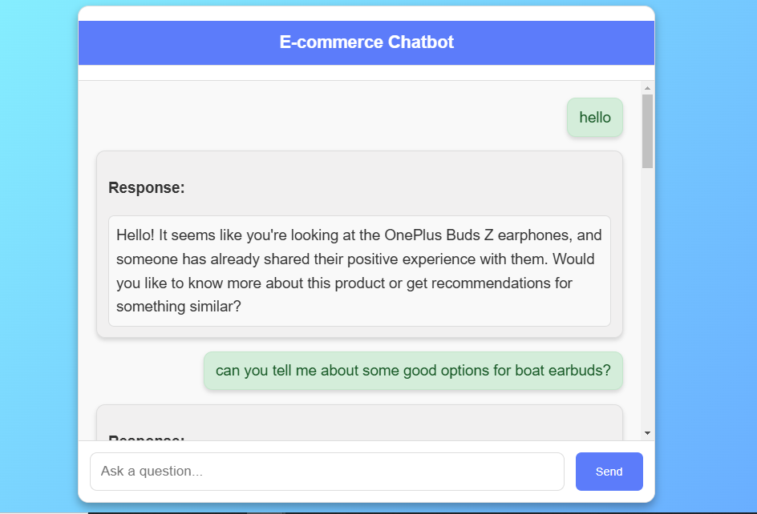
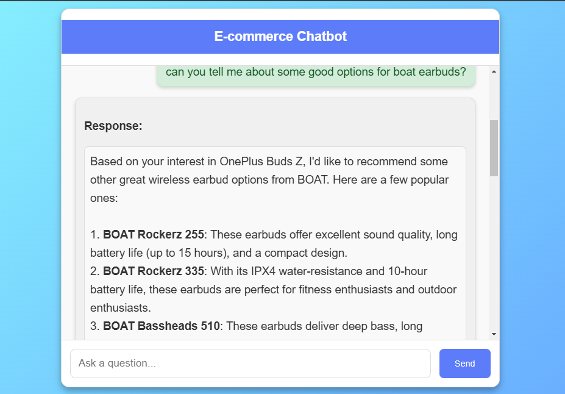
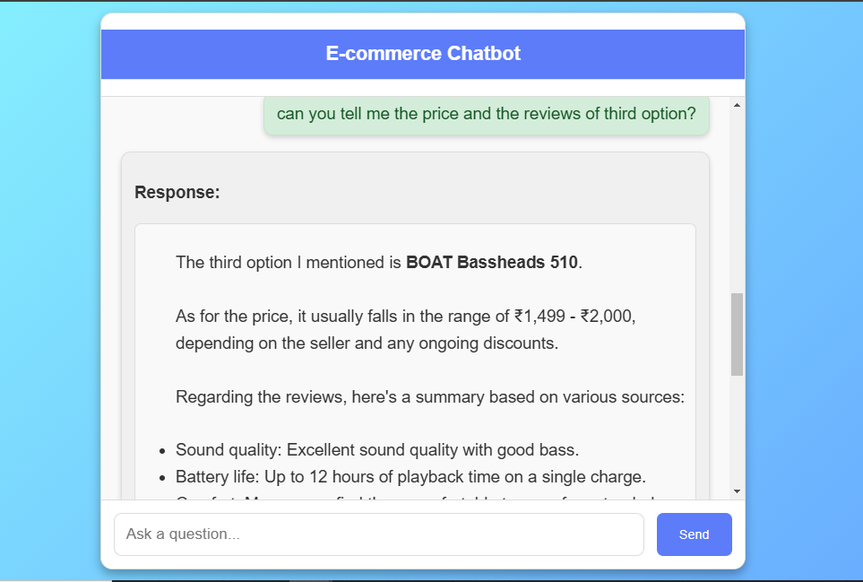

# E-commerce Chatbot using RAG with LLAMA and LangChain

# Introduction

This project is an **E-commerce Chatbot** built using a **Retrieval-Augmented Generation (RAG)** approach. RAG combines the power of information retrieval and generative language models, enabling the chatbot to provide accurate and context-aware responses based on extensive product-related information stored in a vector database. We used **LangChain** as the framework to manage the chatbot’s components and orchestrate the retrieval-generation flow efficiently.

## Model and Embeddings
The chatbot employs **LLaMA 3.1-8b**, a large language model known for its ability to understand nuanced context and generate coherent responses. To enhance retrieval performance, the project leverages embeddings generated by HuggingFace's **sentence-transformers/all-mpnet-base-v2 model**. These embeddings encode semantic meaning, enabling the chatbot to retrieve relevant product data quickly based on user queries. The embeddings are stored and managed in **AstraDB**, which serves as a high-performance vector database.

## RAG with Chat History
To provide coherent, context-aware responses, the chatbot uses a history-aware **RAG** approach. By incorporating **chat history** into each interaction, the model can understand references to previous messages and maintain continuity across multiple turns. **LangChain’s history management** features make this process seamless by allowing stateful management of chat history for each user session.

## Apporach Summary
The **dataset** used in this project comprises product reviews sourced from **Flipkart**, an e-commerce platform. The dataset includes product titles, ratings, and detailed reviews, offering a comprehensive view of customer feedback across various products. The primary purpose of this dataset is to power the chatbot's retrieval capabilities, enabling it to reference real-world product sentiments, features, and customer experiences. Each review is stored as a **Document** object within **LangChain**, containing the review as content and the product name as metadata. The **dataset** is ingested into **AstraDB** as a vector store, enabling **similarity searches** that match user queries with relevant reviews, enhancing the chatbot's recommendations and responses.

## Frontend and Interaction
The frontend is a responsive web interface created using **HTML**, **CSS**, and **JavaScript**, designed to provide an intuitive chat experience. Users can interact with the **chatbot** to inquire about product details and receive personalized recommendations. The interface is styled with **CSS**, featuring a modern gradient background and a structured chat box where user messages and bot responses are displayed in real-time.

## Handling Long Response Times with Redis and Celery
Given the model’s large size, generating responses with **LLaMA 3.1-8b** can occasionally exceed the default **1-minute server timeout limit**. To manage this, we implemented **Redis** as a message broker and **Celery** for background task management. When a user submits a query, the **chatbot** triggers a **Celery** task that processes the response **asynchronously**, allowing the frontend to periodically poll for the response status. This method effectively prevents server timeout errors while ensuring users receive responses without interruptions.

## Deployment on AWS EC2
The **chatbot** is deployed on **AWS EC2**, providing a scalable and robust environment for running the model, handling user interactions, and managing retrievals from the database.

## Tech Stack Used
- **Backend**: Python, Flask, LangChain
- **Model**: LLaMA 3.1-8b (Ollama), HuggingFace sentence-transformers
- **Database**: AstraDB (vector storage for embeddings)
- **Message Queue**: Redis
- **Task Management**: Celery
- **Frontend**: HTML, CSS, JavaScript

## Infrastructure
- **Deployment**: AWS EC2
- **Version Control**: GitHub

## Dataset

Dataset for this Project is taken from Kaggle. Here is the Dataset [Link](https://www.kaggle.com/datasets/jatinsareen/flipkart-dataset). The dataset used in this project contains 450 product reviews about different brands of headphones, erabuds and others collected from Flipkart, including the following key features:

1. Product ID: A unique identifier for each product.
2. Product Title: The name or title of the product, which helps in understanding the product context for recommendations.
3. Rating: A numeric rating (out of 5) given by users, indicating the product's quality.
4. Summary: A short summary or headline of the review.
5. Review: A detailed user review, providing insights into the user's experience with the product.

### These product titles, ratings, summaries, and review texts are leveraged to create embeddings and improve the relevance of chatbot responses in understanding customer inquiries about products. Also, you can download the dataset from [here](data/flipkart_product_review.csv)

#### Dataset Details<a id='dataset-details'></a>
<pre>
Dataset Name            : flipkart_dataset
Number of Columns       : 5
Number of Records       : 450
</pre>

## Installation

The Code is written in Python 3.10.15. If you don't have Python installed you can find it here. If you are using a lower version of Python you can upgrade using the pip package, ensuring you have the latest version of pip.

## Run Locally

### Step-1: Clone the repository to your local machine:
```bash
git clone https://github.com/jatin-12-2002/E-Commerce_ChatBot
```

### Step-2: Navigate to the project directory:
```bash
cd E-Commerce_ChatBot
```

### Step 3: Create a conda environment after opening the repository

```bash
conda create -p env python=3.10 -y
```

```bash
source activate ./env
```

### Step 4: Install the requirements
```bash
pip install -r requirements.txt
```

### Step-5: Set up environment variables:
- Create a .env file in the project directory.
- Define the necessary environment variables such as database connection strings, API keys, etc.
- Your .env file should should have these variables:
```bash
ASTRA_DB_API_ENDPOINT=""
ASTRA_DB_APPLICATION_TOKEN=""
ASTRA_DB_KEYSPACE=""
HF_TOKEN=""
```
- My .env file is [here](https://drive.google.com/file/d/1D_7N8INSDax3oFKJIzbBNp2m8knhiTDV/view?usp=drive_link)

### Step-6: Download the Ollama API.
```bash
curl -fsSL https://ollama.com/install.sh | sh
```

### Step-7: Download the **llama3.1-8B** model.
```bash
ollama pull llama3.1:8b
```

### Step-8: Install Redis
```bash
sudo apt-get update
```
```bash
sudo apt-get install redis-server
```

### Step-9: Start the Redis Server(usually done on port 6379 by default).
```bash
sudo service redis-server start
```

### Step-10: Check if Redis is running. It should return **PONG** if everything is working fine.
```bash
redis-cli ping
```

### Step-11: Start the Celery Worker. In a new terminal window, activate the environment then run:
```bash
celery -A app.celery worker --loglevel=info
```

### Step-12: Run the Flask application. In another terminal, start your Flask application with Gunicorn
```bash
gunicorn -w 2 -b 0.0.0.0:8000 app:app
```

### Step 13 - Prediction application
```bash
http://localhost:5000/

```

## Prediction Outputs





## AWS DEPLOYMENT
### Step 1: Push your entire code to github.
### Step 2: Login to your AWS account Link.
### Step 3: Launch your EC2 Instance.
### Step 4: Configure your EC2 Instance.
```bash
Use t2.large or greater size instances only as it is a GenerativeAI using LLMs project.
```

### Step 5: Command for configuring EC2 Instance.

### INFORMATION: sudo apt-get update and sudo apt update are used to update the package index on a Debian-based system like Ubuntu, but they are slightly different in terms of the tools they use and their functionality:

### Step 6: Connect your EC2 Instance and start typing the following commands

### Step 6.1: This command uses apt-get, the traditional package management tool.
```bash
sudo apt-get update
```

### Step 6.2: This command uses apt, a newer, more user-friendly command-line interface for the APT package management system.
```bash
sudo apt update -y
```

### Step 6.3: Install Nginx, Git and other tools
```bash
sudo apt install git nginx -y
```

### Step 6.3: Install required tools.
```bash
sudo apt install git curl unzip tar make sudo vim wget -y
```

### Step 6.4: Clone git repository.
```bash
git clone https://github.com/jatin-12-2002/E-Commerce_ChatBot
```

### Step 6.5: Navigate to the project directory:
```bash
cd E-Commerce_ChatBot
```

### Step 6.6: Create a .env file there.
```bash
touch .env
```

### Step 6.6: Open file in VI editor.
```bash
vi .env
```

### Step 6.7: Press insert and Mention .env variable then press esc for saving and write :wq for exit.
```bash
ASTRA_DB_API_ENDPOINT=""
ASTRA_DB_APPLICATION_TOKEN=""
ASTRA_DB_KEYSPACE=""
HF_TOKEN=""
```

### Step 6.8: ### For checking the values of .env variables.
```bash
cat .env
```

### Step 6.9: For installing python and pip here is a command
```bash
sudo apt install python3-pip
```

### Step 6.10: install the requirements.txt. The --break-system-packages flag in pip allows to override the externally-managed-environment error and install Python packages system-wide.
```bash
pip3 install -r  requirements.txt
```
**OR**
```bash
pip3 install -r  requirements.txt --break-system-packages
```

### The --break-system-packages flag in pip allows to override the externally-managed-environment error and install Python packages system-wide. pip install package_name --break-system-packages

### Step 6.11: Test the Application with Gunicorn. Verify the app is working by visiting **http://your-ec2-public-ip:8000**
```bash
gunicorn -w 2 -b 0.0.0.0:8000 app:app
```

### Step 6.12: Configure Nginx as a Reverse Proxy. Set up Nginx to forward requests to Gunicorn. Open the Nginx configuration file:
```bash
sudo nano /etc/nginx/sites-available/default
```

### Step 6.13: Update the Nginx configuration as follows:
```bash
server {
    listen 80;
    server_name your-ec2-public-ip;

    location / {
        proxy_pass http://127.0.0.1:8000;
        proxy_set_header Host $host;
        proxy_set_header X-Real-IP $remote_addr;
        proxy_set_header X-Forwarded-For $proxy_add_x_forwarded_for;
        proxy_set_header X-Forwarded-Proto $scheme;
    }
}
```
### Save and close the file

### Step 6.14: Then restart Nginx:
```bash
sudo systemctl restart nginx
```

### Step 6.15: Set Up Gunicorn as a Background Service. To keep Gunicorn running as a service, set up a systemd service file. Create a new service file:
```bash
sudo nano /etc/systemd/system/gunicorn.service
```

### Step 6.14: Update the configuration as follows:
```bash
[Unit]
Description=Gunicorn instance to serve my project
After=network.target

[Service]
User=ubuntu
Group=www-data
WorkingDirectory=/home/ubuntu/E-Commerce_ChatBot_Project
ExecStart=/usr/bin/gunicorn --workers 4 --bind 127.0.0.1:8000 app:app

[Install]
WantedBy=multi-user.target
```
### Save and close the file

### Step 6.15: Start and enable the service:
```bash
sudo systemctl start gunicorn
```
```bash
sudo systemctl enable gunicorn
```

### Step-15: Configure your inbound rule:
1. Go inside the security
2. Click on security group
3. Configure your inbound rule with certain values
4. Port 5000 0.0.0.0/0 for anywhere traffic TCP/IP protocol
5. Port 8000 0.0.0.0/0 for anywhere traffic TCP/IP protocol
6. Port 11434 0.0.0.0/0 for anywhere traffic TCP/IP protocol

### Step-16: Save it and now run your application.
```bash
gunicorn -w 2 -b 0.0.0.0:8000 app:app
```

### Step 17 - Run the Public Port of EC2 Instance
```bash
Public_Address:8080
```

### If you encounter any error like code:400 while running "https:{Public_address}:5000" then just run it with 'http' instead of 'https'.


### Check that your app is accessible through http://your-ec2-public-ip. Nginx will forward requests to Gunicorn, which serves the Flask app.


### This setup makes your app production-ready by using Nginx and Gunicorn for stability, performance, and scalability. You can continue to scale by increasing Gunicorn workers or adding load balancing if traffic grows.

## Conclusion 